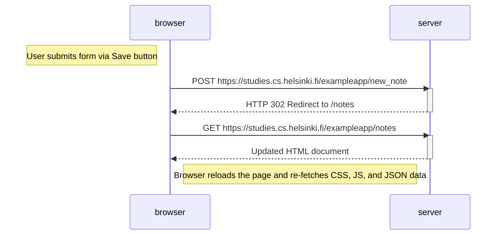

```mermaid
sequenceDiagram
    participant browser
    participant server

    Note left of browser: User submits form via Save button
    browser->>server: POST https://studies.cs.helsinki.fi/exampleapp/new_note 
    activate server
    server-->>browser: HTTP 302 Redirect to /notes
    deactivate server

    browser->>server: GET https://studies.cs.helsinki.fi/exampleapp/notes 
    activate server
    server-->>browser: Updated HTML document
    deactivate server

    Note right of browser: Browser reloads the page and re-fetches CSS, JS, and JSON data
```
