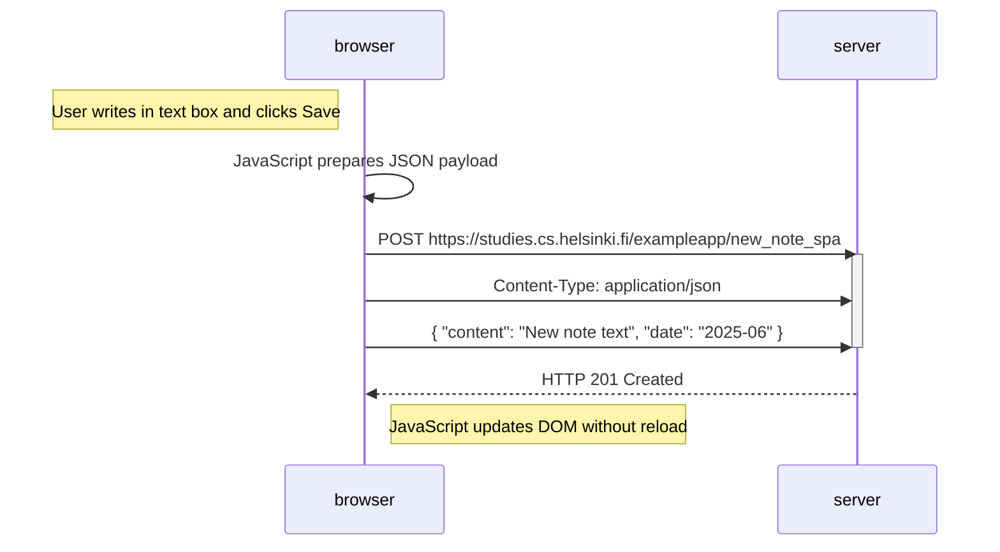

```mermaid
sequenceDiagram
    participant browser
    participant server

    Note left of browser: User writes in text box and clicks Save
    browser->>browser: JavaScript prepares JSON payload
    browser->>server: POST https://studies.cs.helsinki.fi/exampleapp/new_note_spa 
    activate server
    browser->>server: Content-Type: application/json
    browser->>server: { "content": "New note text", "date": "2025-06" }
    deactivate server

    server-->>browser: HTTP 201 Created
    Note right of browser: JavaScript updates DOM without reload
```
